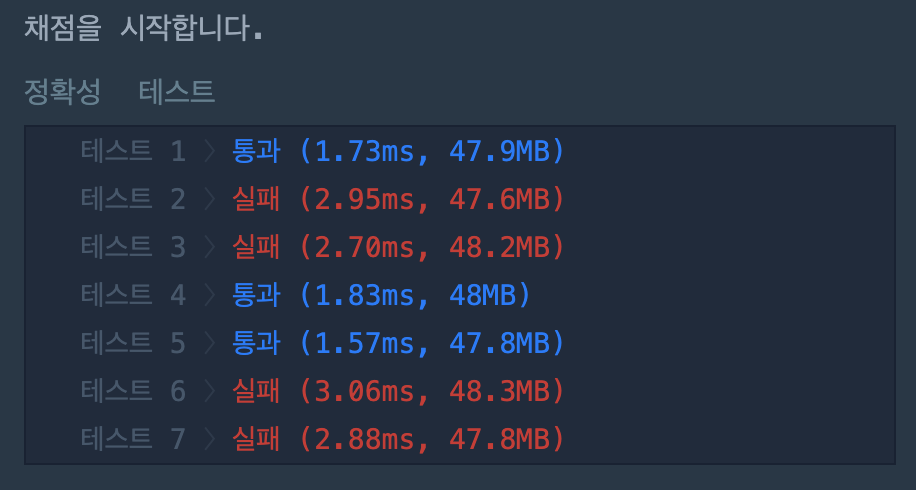

# K번째 수

## 문제 설명

배열 array의 i번째 숫자부터 j번째 숫자까지 자르고 정렬했을 때, k번째에 있는 수를 구하려 합니다.

예를 들어 array가 [1, 5, 2, 6, 3, 7, 4], i = 2, j = 5, k = 3이라면

1. array의 2번째부터 5번째까지 자르면 [5, 2, 6, 3]입니다.
2. 1에서 나온 배열을 정렬하면 [2, 3, 5, 6]입니다.
3. 2에서 나온 배열의 3번째 숫자는 5입니다.

배열 array, [i, j, k]를 원소로 가진 2차원 배열 commands가 매개변수로 주어질 때, commands의 모든 원소에 대해 앞서 설명한 연산을 적용했을 때 나온 결과를 배열에 담아 return 하도록 solution 함수를 작성해주세요.


## 제한 사항

- array의 길이는 1 이상 100 이하입니다.
- array의 각 원소는 1 이상 100 이하입니다.
- commands의 길이는 1 이상 50 이하입니다.
- commands의 각 원소는 길이가 3입니다.


## 입출력 예

| array                 | commands                          | return    |
| :-------------------- | :-------------------------------- | :-------- |
| [1, 5, 2, 6, 3, 7, 4] | [[2, 5, 3], [4, 4, 1], [1, 7, 3]] | [5, 6, 3] |


## 입출력 예 설명

[1, 5, 2, 6, 3, 7, 4]를 2번째부터 5번째까지 자른 후 정렬합니다. [2, 3, 5, 6]의 세 번째 숫자는 5입니다.
[1, 5, 2, 6, 3, 7, 4]를 4번째부터 4번째까지 자른 후 정렬합니다. [6]의 첫 번째 숫자는 6입니다.
[1, 5, 2, 6, 3, 7, 4]를 1번째부터 7번째까지 자릅니다. [1, 2, 3, 4, 5, 6, 7]의 세 번째 숫자는 3입니다.


# 풀이

## 첫 번째 풀이

* **코드**

  ```java
  package kth_number;
  
  import java.util.Arrays;
  
  public class KthNumber {
      public static int[] solution(int[] array, int[][] commands) {
          int[] answer = new int[commands.length];
          int[] sort;
          int index = 0;
          int commandsHeadIndex;
          int commandsTailIndex;
          int commandsCount;
  
          for (int i = 0; i < commands.length; i++) {
              commandsHeadIndex = commands[i][0] - 1;
              commandsTailIndex = commands[i][1] - 1;
              commandsCount = commands[i][2] - 1;
  
              sort = new int[commandsTailIndex - commandsHeadIndex + 1];
  
              for (int j = commandsHeadIndex; j <= commandsTailIndex; j++) {
                  sort[index] = array[j];
                  index++;
              }
              index = 0;
              sort = sortArray(sort);
  
              answer[i] = sort[commandsCount];
          }
  
          return answer;
      }
  
  	  // 버블 정렬을 사용
      public static int[] sortArray(int[] array) {
          int tmp;
          for (int i = 0; i < array.length; i++) {
              for (int j = i + 1; j < array.length; j++) {
                  if (array[j-1] > array[j]) {
                      tmp = array[j-1];
                      array[j-1] = array[j];
                      array[j] = tmp;
                  }
              }
          }
          return array;
      }
  
      public static void main(String[] args) {
          int[] array = new int[]{1, 5, 2, 6, 3, 7, 4};
          int[][] commands = {
                  {2, 5, 3},
                  {4, 4, 1},
                  {1, 7, 3}
          };
  
          int[] answer = solution(array, commands);
  
          for(int i = 0; i < answer.length; i++) {
              System.out.print(answer[i] + ",");
          }
      }
  }
  ```

* **코드 채점 결과**

  

  > 런타임이 길어서 실패..


## 두 번째 풀이

* **코드**

  ```java
  package kth_number;
  import java.util.ArrayList;
  import java.util.Comparator;
  import java.util.List;
  import java.util.stream.Collectors;
  
  public class KthNumber {
      public static int[] solution(int[] array, int[][] commands) {
          int[] answer = new int[commands.length];
          // 정렬되지 않은 배열을 저장할 리스트
          List<Integer> commandList = new ArrayList<Integer>();
          // 정렬된 배열을 저장할 리스트
          List<Integer> sortedList;
  
          int commandsHeadIndex;
          int commandsTailIndex;
          int commandsCount;
  
          for (int i = 0; i < commands.length; i++) {
              commandsHeadIndex = commands[i][0] - 1;
              commandsTailIndex = commands[i][1] - 1;
              commandsCount = commands[i][2] - 1;
  
              // 가져올 요소들을 리스트에 저장
              for (int j = commandsHeadIndex; j <= commandsTailIndex; j++) {
                  commandList.add(array[j]);
              }
  
              // 가져온 요소들을 스트림을 사용해서 정렬시킨다.
              sortedList = commandList.stream()
                      .sorted(Comparator.naturalOrder())
                      .collect(Collectors.toList());
  
              // 지정된 인덱스의 값을 저장
              answer[i] = sortedList.get(commandsCount);
              // 정렬되지 않은 리스트 비우기
              commandList.clear();
          }
  
          return answer;
      }
  
      public static void main(String[] args) {
          int[] array = new int[]{1, 5, 2, 6, 3, 7, 4};
          int[][] commands = {
                  {2, 5, 3},
                  {4, 4, 1},
                  {1, 7, 3}
          };
  
          int[] answer = solution(array, commands);
  
          for(int i = 0; i < answer.length; i++) {
              System.out.print(answer[i] + ",");
          }
      }
  }
  ```

* **코드 채점 결과**

  

  > 컬렉션과 스트림을 사용해서 속도를 줄여서 성공하였다.


# 다른 사람의 풀이

* **코드**

  ```java
  import java.util.Arrays;
  class Solution {
      public int[] solution(int[] array, int[][] commands) {
          int[] answer = new int[commands.length];
  
          for(int i=0; i<commands.length; i++){
            // copyOfRange 메소드를 통해서 슬라이싱을 하고
              int[] temp = Arrays.copyOfRange(array, commands[i][0]-1, commands[i][1]);
            // sort 메소드를 통해 정렬을 하였다.
              Arrays.sort(temp);
              answer[i] = temp[commands[i][2]-1];
          }
  
          return answer;
      }
  }
  ```

  